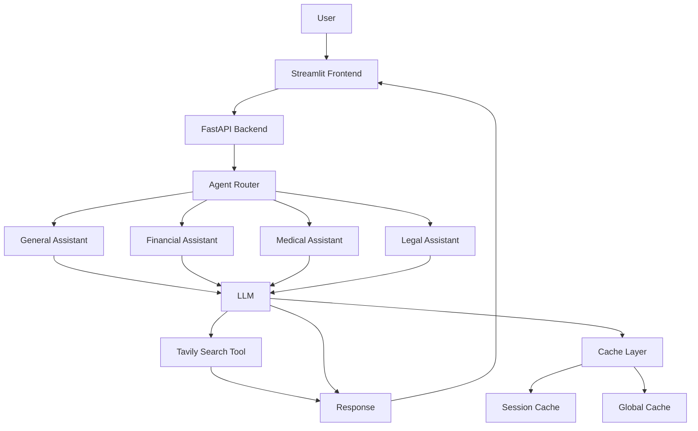
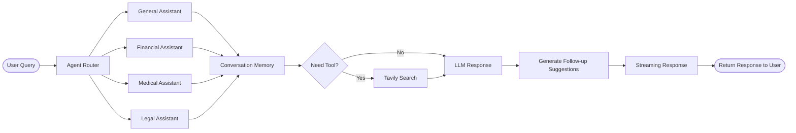
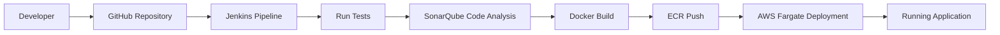

---

# Multi-Agent LLM Application

## Table of Contents

- [Overview](#overview)
- [Vision](#vision)
- [Project Structure](#project-structure)
- [Architecture](#architecture)
- [System Architecture Diagram](#system-architecture-diagram)
- [Agent Workflow](#agent-workflow)
- [CI/CD Pipeline](#cicd-pipeline)
- [Pain Points and Solutions](#pain-points-and-solutions)
- [Tech Stack](#tech-stack)
- [System Design Considerations](#system-design-considerations)
- [Installation](#installation)
- [Environment Variables](#environment-variables)
- [Running the Application](#running-the-application)
- [Features](#features)
- [Future Improvements](#future-improvements)
- [License](#license)

---

# Overview

This project implements a **configurable multi-agent LLM system** that enables dynamic agent behavior selection and tool-based reasoning using **LangGraph orchestration**.

The system allows multiple agents to collaborate, access external tools, and dynamically determine execution paths to answer user queries.

The application integrates:

- **FastAPI backend** for agent orchestration
- **Streamlit frontend** for interactive conversations
- **LangGraph agent workflows**
- **LLM integrations (OpenAI and Groq)**
- **External tool usage via Tavily search**
- **Caching mechanisms for optimized performance**
- **Observability dashboard using Prometheus and Grafana**
- **Docker-based containerization**
- **CI/CD pipeline using Jenkins**
- **AWS deployment infrastructure**

[⬆ Back to Top](#table-of-contents)

---

# Vision

The goal of this project is to build a **scalable, production-oriented multi-agent LLM system** that addresses common challenges faced in real-world AI applications.

While many LLM applications focus only on generating responses, production systems must also handle challenges such as:

- Latency
- Cost optimization
- Conversational continuity
- System reliability
- Task specialization
- Observability

This project explores how **agent orchestration, caching strategies, tool integration, and multi-model support** can be combined to build a robust conversational AI platform.

The vision behind this system is to:

- Reduce **LLM latency and operational cost**
- Maintain **context-aware conversations**
- Encourage **engaging and interactive user experiences**
- Improve **system reliability**
- Support **specialized domain assistants**
- Demonstrate **production-grade MLOps practices**
- Showcase **observability through dashboards**

[⬆ Back to Top](#table-of-contents)

---

# Project Structure

```
AI_agent_app
├── multi_agent_app
│   ├── backend
│   ├── frontend
│   ├── cache
│   ├── core
│   ├── config
│   └── common
├── Dockerfile
├── requirements.txt
└── pyproject.toml
└── prometheus.yml
```

[⬆ Back to Top](#table-of-contents)

---

# Architecture

High-level architecture of the system:

```
User Interface (Streamlit)
        ↓
FastAPI Backend
        ↓
LangGraph Agent Workflow
        ↓
LLM + Tools
(OpenAI / Groq / Tavily)
        ↓
Caching Layer
```

Core architectural components:

- **Streamlit UI**
- **FastAPI backend**
- **LangGraph agent orchestration**
- **External tool integrations**
- **Caching layer**
- **Multi-model LLM support**
- **Real-time dashboard**

[⬆ Back to Top](#table-of-contents)

---

# System Architecture Diagram



[⬆ Back to Top](#table-of-contents)

---

# Agent Workflow



[⬆ Back to Top](#table-of-contents)

---

# CI/CD Pipeline



[⬆ Back to Top](#table-of-contents)

---

# Pain Points and Solutions

### 1. Repeated Queries Increase Cost and Latency

**Pain Point**

Repeated user queries trigger identical LLM or tool calls.

**Solution**

Implemented **multi-layer caching**:

- Session Cache
- Global Cache

---

### 2. Lack of Conversational Memory

**Pain Point**

Agents without context awareness produce fragmented conversations.

**Solution**

Integrated **LangGraph conversational memory**.

---

### 3. Static Question–Answer Interaction

**Pain Point**

Traditional assistants answer queries but do not continue conversations.

**Solution**

Agents generate **three follow-up topic suggestions**.

These appear as **interactive buttons in the Streamlit UI**.

---

### 4. Slow Response Times

**Pain Point**

Long response times reduce user satisfaction.

**Solution**

- Cached LLM instances
- Cached agent initialization
- Cached tool search results
- Streaming responses

---

### 5. Single Model Provider Risk

**Pain Point**

Reliance on one provider creates a single point of failure.

**Solution**

Support for **OpenAI and Groq models**.

---

### 6. General Assistants Cannot Handle Specialized Tasks

**Pain Point**

A single assistant cannot reliably answer specialized questions.

**Solution**

Domain-specific assistants:

- General
- Financial
- Medical
- Legal

---

### 7. Multi-Agent applications lack observability

**Pain Point**

The user is not able to log metrics, track them and view them in clean dashboards.

**Solution**

Prometheus continuously scrapes metrics exposed by the FastAPI backend at the `/metrics` endpoint, collecting data such as request counts, latency, cache hits, and errors. Grafana then queries Prometheus to visualize these metrics in dashboards, which are embedded directly inside the Streamlit app using an iframe for **real-time observability**.


[⬆ Back to Top](#table-of-contents)

---

# Tech Stack

### Core Frameworks

- LangChain
- LangGraph
- FastAPI
- Streamlit

### LLM Providers

- OpenAI
- Groq

### Tools

- Tavily Search API

### Monitoring Stack

- Prometheus
- Grafana

### Infrastructure

- Docker
- Jenkins
- SonarQube
- AWS (ECR + Fargate)

[⬆ Back to Top](#table-of-contents)

---

# System Design Considerations

Key design principles:

- Modular architecture
- Multi-agent orchestration
- Multi-layer caching
- Multi-model support
- Streaming responses
- CI/CD automation

[⬆ Back to Top](#table-of-contents)

---

# Installation

Clone the repository:

```bash
git clone https://github.com/Joab-David-Johanan/Multi-AI-Agent
cd Multi-AI-Agent
```

Install the project:

```bash
pip install -e .
```

Install dependencies:

```bash
pip install -r requirements.txt
```

[⬆ Back to Top](#table-of-contents)

---

# Environment Variables

Create `.env` file:

```
OPENAI_API_KEY=your_openai_key
GROQ_API_KEY=your_groq_key
TAVILY_API_KEY=your_tavily_key
LANGCHAIN_API_KEY=your_langchain_key
```

[⬆ Back to Top](#table-of-contents)

---

# Running the Application

Run the full app:

```bash
python multi_agent_app/main.py
```

Run backend separately:

```bash
fastapi dev multi_agent_app/backend/api.py
```

Run frontend separately:

```bash
streamlit run multi_agent_app/frontend/main.py
```

[⬆ Back to Top](#table-of-contents)

---

# Features

- Multi-agent orchestration
- Tool-based reasoning
- Context-aware conversations
- Multi-layer caching
- Streaming responses
- Domain-specific assistants
- Docker containerization
- CI/CD pipeline

[⬆ Back to Top](#table-of-contents)

---

# Future Improvements

Potential future work:

- Implement TTL (time to live) rules for cache invalidation strategy
- Model comparison for same user query
- User votes on whether AI response was useful
- Evaluation pipelines
- Kubernetes deployment

[⬆ Back to Top](#table-of-contents)

---

# License

This project is released under the **MIT License**.

---

## Deployment steps:

### Follow these steps for AWS Fargate deployment

### 1. Create `custom_jenkins` Folder (already done if repo is cloned)

### 2. Create `Dockerfile` Inside `custom_jenkins` (already done if repo is cloned)

### 3. Build Docker Image

Build the Docker image for Jenkins:

```
docker build -t jenkins-dind .
```

### 4. Run Jenkins Container

Run the Jenkins container with the following command:

```
docker run -d --name jenkins-dind \
  --privileged \
  -p 8080:8080 -p 50000:50000 \
  -v /var/run/docker.sock:/var/run/docker.sock \
  -v jenkins_home:/var/jenkins_home \
  jenkins-dind
```

> After successful execution, you'll receive a long alphanumeric string.

### 5. Verify the Running Container

To verify if the Jenkins container is running:

```
docker ps
```

### 6. Get Jenkins Logs and Password

To retrieve Jenkins logs and get the initial admin password:

```
docker logs jenkins-dind
```

> You should see a password in the output. Copy that password.

### 7. Find WSL IP Address

Run the following command to get the IP address of your WSL environment:

```
ip addr show eth0 | grep inet
```

### 8. Access Jenkins

Now, access Jenkins on your browser using the following URL (replace 172.23.129.123 with the actual WSL IP address you retrieved):

```
http://172.23.129.123:8080
```

### 9. Install Python and Set Up Jenkins

Return to the terminal and run the following commands to install Python inside the Jenkins container:

```
docker exec -u root -it jenkins-dind bash
apt update -y
apt install -y python3
python3 --version
ln -s /usr/bin/python3 /usr/bin/python
python --version
apt install -y python3-pip
exit
```

### 10. Restart Jenkins Container

Restart the Jenkins container to apply changes:

```
docker restart jenkins-dind
```

### 11. Sign in to Jenkins

Go to the Jenkins dashboard and sign in using the initial password you retrieved earlier.

---

## Steps for : GitHub Integration with Jenkins

Follow the steps below to integrate GitHub with Jenkins for automated pipeline execution:

### 1. Generate Personal GitHub Access Token

1. Go to **GitHub**.
2. Navigate to **Settings** -> **Developer Settings** -> **Personal Access Tokens** -> **Classic**.
3. Click on **Generate New Token**.
4. Provide a **name** and select the following **permissions**:
   - `repo` (for repository access)
   - `repo_hook` (for hook access)
5. Click **Generate Token**.
6. **Save** the token securely somewhere (you will not be able to view it again after this page).

---

### 2. Add GitHub Token to Jenkins

1. Go to the **Jenkins Dashboard**.
2. Click **Manage Jenkins** -> **Manage Credentials** -> **Global**.
3. Click **Add Credentials**.
4. In the **Username** field, enter your **GitHub account name**.
5. In the **Password** field, paste the **GitHub token** you just generated.
6. In the **ID** field, enter a name for this credential (e.g., `github-token`).
7. Add a **Description** (e.g., `GitHub access token`).
8. Click **OK** to save the credentials.


### 3. Create a Pipeline Job in Jenkins

1. Go to the **Jenkins Dashboard**.
2. Click on **New Item**.
3. Select **Pipeline** and provide a name for the job.
4. Click **Apply** and then **Create**.

---

### 4. Configure Pipeline Checkout

1. On the left sidebar of the Jenkins job, click **Pipeline Syntax**.
2. Under **Step**, select **checkout**.
3. Fill in the necessary details, such as:
   - **Repository URL** (your GitHub repository URL)
   - **Credentials** (select the `github-token` created earlier)
4. Click **Generate Pipeline Script**.
5. Copy the generated script.

---

### 5. Create `Jenkinsfile` in VS Code

1. Open **VS Code** and create a file named **`Jenkinsfile`** ( already done if cloned )
2. For now only keep the first stage of Jenkinsfile rest should be commendted out.


> **Explanation**: This simple pipeline has one stage, **Checkout**, where Jenkins will fetch the latest code from your GitHub repository.

3. Push the `Jenkinsfile` to your GitHub repository.

---

### 6. Run the Pipeline

1. Go back to the **Jenkins Dashboard**.
2. Click on **Build Now** for your pipeline job.
3. Wait for the build process to complete.

---

### 7. Check Pipeline Success

Once the pipeline finishes, you will see a success message, indicating that your first pipeline run was successful. Additionally, in the **Workspace** of the job, you will see that Jenkins has cloned your GitHub repository.

---

## Steps for : SonarQube Integration with Jenkins

Follow these steps to integrate **SonarQube** with Jenkins for code quality analysis.

### 1. Download and Run SonarQube Docker Container

1. Go to **DockerHub** and search for **SonarQube**. Scroll down to find the commands.
2. Run the following commands in a new WSL terminal to configure the system:

```bash
sysctl -w vm.max_map_count=524288
sysctl -w fs.file-max=131072
ulimit -n 131072
ulimit -u 8192
```

3. Run the SonarQube container with the appropriate settings. Make sure to change the container name to `sonarqube-dind` and remove the dollar sign (`$`) from the command. You will find the command in the **Demo** section of DockerHub.

```bash
docker run -d --name sonarqube-dind \
  -p 9000:9000 \
  -e SONARQUBE_JDBC_URL=jdbc:postgresql://localhost/sonar \
  sonarqube
```

4. Check if the container is running:

```bash
docker ps
```

5. Access **SonarQube** on `http://<WSL_IP>:9000` (replace `<WSL_IP>` with your WSL IP address). Log in using the default credentials:  
   - **Username:** `admin`  
   - **Password:** `admin`

---

### 2. Install Jenkins Plugins for SonarQube

1. Go to **Jenkins Dashboard** -> **Manage Jenkins** -> **Manage Plugins**.
2. Install the following plugins:
   - **SonarScanner**
   - **SonarQualityGates**

3. Restart the Jenkins container:

```bash
docker restart jenkins-dind
```

---

### 3. Set Up SonarQube in Jenkins

1. Go to **SonarQube** -> **Create a Local Project**.
   - Enter a name for the project (e.g., `LLMOPS`).
   - Set the **Main Branch**.
   - Save the project.

2. Go to **SonarQube** -> **My Account** (top-right) -> **Security** -> **Generate New Token**.
   - Provide a name (e.g., `global-analysis-token`) and generate the token.
   - Copy the generated token.

3. Go to **Jenkins Dashboard** -> **Manage Jenkins** -> **Credentials** -> **Global**.
4. Add a new **Secret Text** credential:
   - **ID:** `sonarqube-token`
   - **Secret:** Paste the token from SonarQube.
   - Click **OK** to save.

---

### 4. Configure SonarQube in Jenkins

1. Go to **Manage Jenkins** -> **System Configuration**.
2. Scroll down to **SonarQube Servers** and click **Add SonarQube**.
   - **Name:** `SonarQube` (or any name you prefer)
   - **URL:** `http://<WSL_IP>:9000` (replace `<WSL_IP>` with your actual IP address)
   - Select **SonarQube Token** from the credentials dropdown.
   - Apply and save.

3. Go to **Manage Jenkins** -> **Tools** and look for **SonarQube Scanner**.
   - Select **SonarQube Scanner** and configure it.
   - Tick the option **Install Automatically**.

---

### 5. Create a Stage in `Jenkinsfile` for SonarQube

1. Open the **Jenkinsfile** in **VS Code** and add the Sonarqube stage ( already provided in the code )


2. Push the changes to your **GitHub** repository.

---

### 6. Create a Docker Network for Jenkins and SonarQube

1. Run the following command to create a new Docker network:

```bash
docker network create dind-network
```

2. Connect both containers to the new network:

```bash
docker network connect dind-network jenkins-dind
docker network connect dind-network sonarqube-dind
```

3. Update the `Jenkinsfile` to use the container name instead of the IP address:  (already done in code )

```groovy
-Dsonar.host.url=http://sonarqube-dind:9000
```

---

### 7. Final Pipeline Run

1. Trigger the **Jenkins Pipeline** .
2. The build should now be successful, and the code will be analyzed by **SonarQube**.

---

### 8. View Results in SonarQube

Go to **SonarQube** and see the code quality report generated for your project.

---

## Steps for :  AWS Setup and Build & Push to AWS

Follow these steps to set up AWS integration with Jenkins for building and pushing Docker images to **Amazon ECR**.

### 1. Install Required Jenkins Plugins

1. Go to **Manage Jenkins** -> **Manage Plugins**.
2. Search for and install the following plugins:
   - **AWS SDK** (All)
   - **AWS Credentials**

3. Restart **jenkins-dind** after the plugins installation:

```bash
docker restart jenkins-dind
```

---

### 2. Create an IAM User for AWS Access

1. Go to the **AWS Console** → **IAM** → **Users** → **Add User**.
2. Add the necessary policies:
   - Attach the policy: **AmazonEC2ContainerRegistryFullAccess**

3. Once the user is created, select the user and click on **Create Access Key**.
4. Copy the **Access Key ID** and **Secret Access Key**.

---

### 3. Add AWS Credentials to Jenkins

1. Go to **Jenkins Dashboard** → **Manage Jenkins** → **Manage Credentials** → **Global**.
2. Add a new **AWS Credentials**:
   - **ID:** `aws-credentials`
   - **Access Key ID:** Paste the **Access Key ID** from AWS.
   - **Secret Access Key:** Paste the **Secret Access Key** from AWS.
   
3. Save the credentials.

---

### 4. Install AWS CLI on Jenkins Container

1. Open a new terminal and run the following commands inside your **jenkins-dind** container:

```bash
docker exec -u root -it jenkins-dind bash
```

2. Update the package list and install required tools:

```bash
apt update
apt install -y unzip curl
```

3. Download and install **AWS CLI**:

```bash
curl "https://awscli.amazonaws.com/awscli-exe-linux-x86_64.zip" -o "awscliv2.zip"
unzip awscliv2.zip
./aws/install
```

4. Verify the installation:

```bash
aws --version
```

5. Exit the container:

```bash
exit
```

---

### 5. Create an ECR Repository in AWS

1. Go to **AWS Console** → **ECR (Elastic Container Registry)** → **Create Repository**.
2. Name the repository (e.g., `my-repository`).
3. Set up the repository as required and save the repository URL for later use.

---

### 6. Add Build and Push Docker Image to ECR Stage in Jenkinsfile

Already done if clone just change according to your repo name..

### 7. Push the Changes to GitHub

Push the updated `Jenkinsfile` to your GitHub repository to trigger the pipeline.

---

### 8. Run the Jenkins Pipeline

1. Go to the **Jenkins Dashboard**.
2. Click on **Build Now** for your pipeline.
3. The pipeline will execute, building the Docker image and pushing it to **Amazon ECR**.

---

**Congratulations!** Your Docker image has been successfully built and pushed to Amazon ECR using Jenkins.

## Step 5 : Final Deployment Stage with AWS ECS and Jenkins

Follow these steps to deploy your app to **AWS ECS Fargate** using Jenkins and automate the deployment process.

### 1. Create ECS Cluster and Task Definition

1. **Create ECS Cluster**:
   - Go to **ECS** → **Clusters** → **Create Cluster**.
   - Give your cluster a name and select **Fargate**.
   - Click **Create** to create the cluster.

2. **Create ECS Task Definition**:
   - Go to **ECS** → **Task Definitions** → **Create new Task Definition**.
   - Select **Fargate** as the launch type.
   - Give the task definition a name (e.g., `llmops-task`).

3. **Container Configuration**:
   - Under **Container details**, give the container a name and use the **ECR URI** (the Docker image URL from your ECR repository).
   - In **Port Mapping**, use the following configuration:
     - **Port:** 8501
     - **Protocol:** TCP
     - **None:** leave it as default.
   
4. **Create Task Definition**:
   - Click **Create** to create the task definition.

---

### 2. Create ECS Service

1. Go to **ECS** → **Clusters** → Your cluster.
2. Click **Create Service**.
3. Select your **Task Definition** (`llmops-task`).
4. Select **Fargate** for launch type (this should be the default option).
5. Give the service a name (e.g., `llmops-service`).
6. Under **Networking**, select:
   - **Public IP**: Allow a public IP.
7. Click **Create** and wait for a few minutes for the service to be deployed.

---

### 3. Configure Security Group for Public Access

1. Search for **Security Groups** in the AWS console.
2. Select the **Default security group**.
3. Go to the **Inbound Rules** and click **Edit inbound rules**.
4. Add a new **Custom TCP rule** with the following details:
   - **Port range:** 8501
   - **Source:** 0.0.0.0/0 (allow access from all IPs).
5. Save the rules.

---

### 4. Check the Deployment

1. After the ECS service has been deployed (this may take a few minutes), go to your ECS cluster.
2. Open the **Tasks** tab and copy the **Public IP** of your task.
3. Open a browser and visit: `http://<PublicIP>:8501`.
   - You should see your app running.

---

### 5. Automate Deployment with Jenkins

1. **Add ECS Full Access Policy** to the IAM user:
   - Go to **IAM** → **Users** → **Your IAM User** → **Attach Policies**.
   - Attach the **AmazonEC2ContainerServiceFullAccess** policy to the IAM user.

2. **Update Jenkinsfile for ECS Deployment**:
   - Add the deployment stage to your `Jenkinsfile`. This will automate the deployment of your Docker container to AWS ECS.

3. Push the updated code to GitHub.

---

### 6. Build Jenkins Pipeline

1. Go to **Jenkins Dashboard**.
2. Click on **Build Now** to trigger the Jenkins pipeline.
3. The pipeline will run, and you will see the task in the **ECS Service** go to **In Progress**.
4. Once the pipeline is complete, your service will be **Running** again.

---

### 7. Verify the Deployment

1. Open the ECS cluster and check the **Task** status.
2. After the task is successfully deployed, visit your app at `http://<PublicIP>:8501` to ensure it is working.

---

### 8. Option 1: Use AWS ECS Environment Variables (Simplest)

1. Go to your ECS **Task Definition** in the AWS Console.
2. Edit the container definition.
3. Scroll to the **Environment Variables** section.
4. Add the following environment variables:
   - **GROQ_API_KEY:** `gsk_...`
   - **TAVILY_API_KEY:** `tvly-dev-...`
5. Save the changes and **redeploy the task**.

---

### ✅ **Deployment Complete**

Your app is now deployed to AWS ECS Fargate. You can access it via the public IP at port `8501`. The deployment process has been automated using Jenkins, and the app is now live.

---

### Follow these steps for AWS EC2 deployment

### 1. Log-in to AWS console.

### 2. Create IAM user for deployment

      # with specific access
      1. EC2 access: For setting up a virtual server.
      2. ECR access: Elastic container registry to save your docker image in aws.

      # Policy
      1. AmazonEC2ContainerRegistryFullAccess
      2. AmazonEC2FullAccess

      # Description: About the deployment
      1. Build Docker image of the source code.
      2. Push your Docker image to ECR.
      3. Launch your EC2.
      4. Pull your Docker image from ECR to EC2.
      5. Launch your Docker image in EC2.

### 3. Create ECR repo to store/save Docker image

```bash
# Save the URI
454041007932.dkr.ecr.us-east-1.amazonaws.com/multi_agent_app
```

### 4. Create a EC2 instance (Ubuntu)

      # Allow HTTPS and HTTP traffic.
      # Choose 8gb instance (t2.large).
      # Choose 30gb storage.

### 5. Launch the EC2 instance and install Docker in the EC2 instance

1. optional

```bash
sudo apt-get update -y
```

```bash
sudo apt-get upgrade
```

2. required

```bash
curl -fsSL https://get.docker.com -o get-docker.sh
```

```bash
sudo sh get-docker.sh
```

```bash
sudo usermod -aG docker ubuntu
```

```bash
newgrp docker
```

### 6. Configure EC2 instance as a self-hosted runner

      settings-->actions-->runner-->new self hosted runner-->choose os-->then run command one by one

### 7. Setup Github secrets

- AWS_ACCESS_KEY_ID
- AWS_SECRET_ACCESS_KEY
- AWS_DEFAULT_REGION
- ECR_REPO_NAME
- LANGCHAIN_API_KEY
- TAVILY_API_KEY
- OPENAI_API_KEY

### 8. Ensure conditional integration and deployment with tags

1. Make sure all your changes (including YAML) are committed

```bash
git add .
git commit -m "Initial commit with CI/CD"
```

2. Push your code to GitHub

```bash
git push origin main
```

3. Create a version tag for deployment

```bash
git tag -a v1.0.0 -m "Initial release"
```

4. Push that tag to GitHub (triggers deployment)

```bash
git push origin v1.0.0
```

